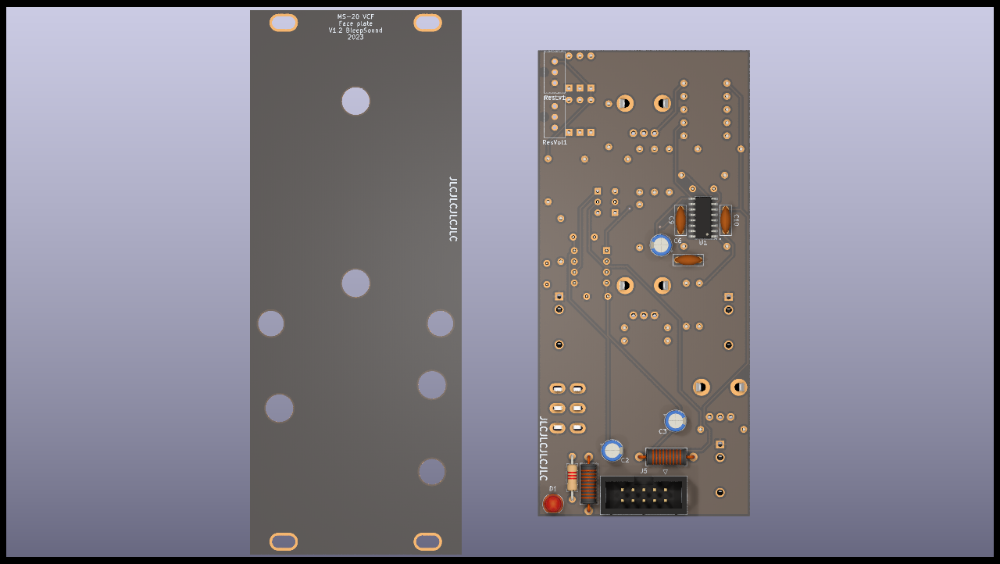

# MS20 VCF

MS20-VCF clone based on BartonSynth version.

Size: 10HP

Cutoff + resonance, with a switch to chose low pass or high pass mode.

CV control on the filter cutoff.

Self oscilation if resonance pushed to maximum, can be adjusted with 2 trimmers :

- 1 trimmer for the sine wave amplitude (resVol)
- 1 trimmer for the level at which the knob for resonance starts the self oscillation (resLvl)

## Schematics

## BoM

[See bom](documentation/bom/MS20-VCF_V1.2--iBoM.html)

You can donwload the bom in excel format [here](https://github.com/BleepSound/ms20-vcf-simple/releases/download/v1.2/MS20-VCF_V1.2--BoM.xlsx).

## Build Informations

Uses an SMD LM13700 because the DIP ones are not produced anymore, hence more expensive.

Regular build, I use ceramic capacitors but you can use film/polyester.

:warning: When building modules, always do it in this order (from smallest component to highest):
- diodes
- resistors
- DIP chips
- capacitors (film/ceramic)
- Transistors
- Electrolytic capacitors

For the next part, always place them without soldering them on:
- jacks, pots and switches that go thought the front panel

Once placed, put in place the front panel, then fasten all components to it. Once this is done, you can solder them.

## Images

## Download

Follow this link if you want to dowload the latest version of gerber files, schematic, kicad files...

:arrow_down: [**Download**](https://github.com/BleepSound/ms20-vcf-simple/releases)